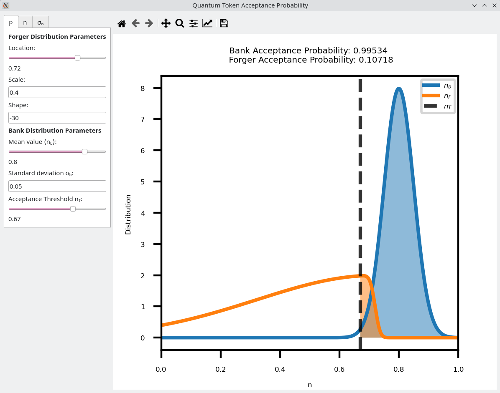

# Ensemble-Based Quantum-Token Protocol Benchmarked on IBMQ

This repository contains all Qiskit implementations and data analysis for the experiments shown in _ , in addition to a GUI application for visualizing and calculating the acceptance fraction of an arbitrary quantum token hardware.

The repository is organized as follows:
- [exp_data](https://github.com/lucas-tsunaki/quantum-token/exp_data) - contains all experimental data obtained in the IBMQ.
- [figures](https://github.com/lucas-tsunaki/quantum-token/figures) - contains all the figures with results, as shown in the paper.
- [sim_results](https://github.com/lucas-tsunaki/quantum-token/sim_results) - contains the simulation scripts and results of the forger acceptance fractions for different normalized contrasts. Due to their high computational costs, they are better run as .py scripts rather than in notebooks .ipynb.
- [01_std_dev](https://github.com/lucas-tsunaki/quantum-token/01_std_dev.ipynb) - the expectation value of the $\hat{N}$ operator and its associated standard deviation $\sigma_N$ are analytically calculated and measured in the IBMQ.
- [02_nb](https://github.com/lucas-tsunaki/quantum-token/02_nb.ipynb) - the bank self-acceptance fractions are measured and analysed.
- [03_na](https://github.com/lucas-tsunaki/quantum-token/03_na.ipynb) - the forger measurement attack on the bank token is performed and visualized.
- [04_nf](https://github.com/lucas-tsunaki/quantum-token/04_nf.ipynb) - the forger uses its measurements results from the attack to forge a fake token and pass to the bank, resulting in certain acceptance probability of this forged token.
- [GUI_qtoken](https://github.com/lucas-tsunaki/quantum-token/GUI_qtoken.py) - GUI application where all results can be calculated and visualized for user defined parameters of the token hardware.

## Installing and Running the GUI Application

The application provides a GUI based on the Python bindings for Qt6. It has dependencies on `NumPy`, `Matplotlib`, `PyQt6`/`PySide6` and `Scipy`. Thus, we recommend creating a `conda` virtual environment with:

```sh
conda create --name qtoken-env python=3.12 numpy matplotlib pyside6 scipy
```

The python script containing the GUI `GUI_qtoken.py` then should downloaded/cloned and launched locally with:

```sh
conda activate qtoken-env
python GUI_qtoken.py
```

The GUI presents three tabs. The first is for calculating the acceptance probability $p$ of the bank and forged tokens given the necessary parameters for the two distributions and the acceptance threshold. The second tab plots the solutions of $n$  as function of the bank angles $\theta_b$ and $\phi_b$, for user defined attacker angles, as in Eq. 4 of the paper. Finally the third tab gives the $\hat{N}$ operator uncertainty $\sigma_N$ for given $N_0$, $N_1$ and $\sigma_{exp}$. The GUI layout is shown below.



## Qiskit Installation for Running Experiments

The measurements were performed using Qiskit 1.1.1 and older. Due to the packages fast development, some of the functionalities here presented are deprecated. If one wishes to run the experiments shown in this repository, Qiskit and Qiskit Runtime must be installed in the conda environment with

```sh
conda activate qtoken-env
conda install jupyter qiskit=1.1.1 qiskit-ibm-runtime=0.24.1
```